## Sportper App With Firebase
A social media app for sport-user using Firebase Back-end, Clean Architecture\
[Demo apk app](./apks/sportper.apk)
### Main Feature
* `Feed` - User can post feed, and other users can like and comment
* `Create games` - User can create game, include game type (football, golf, badminton,...), number of players and other options.
* `Join and invite` - After creating game, other users can join, view the information and chatting with all players joined the games
* `Friends` - Manager friends, include add new friends, send invitations and also accept invitations of other users
* `Notification` - Receive notification for game start, new message chat in a game, receive game invitations, receive friend invitations,...
### Project structure
* `/app` - main application
* `/data` - get data from remote (API) or local (database / local storage) and send to UI layer
* `/domain` - all POJO class, include models app, core of repository
* `/presenter` - code all screens using BLoC state management
* `/env` - config environment
* `/I10n` - config language in app
* `/utils` - utilities for app
  * `definded` - Define some const resource, include images, colors,...
  * `extensions` - extension for app
  * `widgets` - common widgets
### Tech stack:
* Clean Architecture
* [BLoC](https://pub.dev/packages/bloc) - State management
* [Firebase Authentication](https://firebase.google.com/docs/auth) - Login method
* [Cloud Firestore](https://firebase.google.com/docs/firestore) - Database and chat
* [Cloud Storage for Firebase](https://firebase.google.com/docs/storage) - Upload and save images
* [Firebase Cloud Messaging](https://firebase.google.com/docs/cloud-messaging) - Receive notification for client side
* [Cloud Functions](https://firebase.google.com/docs/functions) - Send notification for server side, check this [repo](https://github.com/tungnddev/sportper_firebase_cloud_functions)

### Usage
* Install Flutter 3.3.2
* Run `flutter pub get` to get and sync all library
* Run `flutter pub run intl_utils:generate` to generate files language
* Run `flutter pub run build_runner build --delete-conflicting-outputs` to generate all models flow json
* Run on device `flutter run`
* Build apk `flutter build apk`
* Build ios `flutter build ios`
### Screenshots
##### Feed

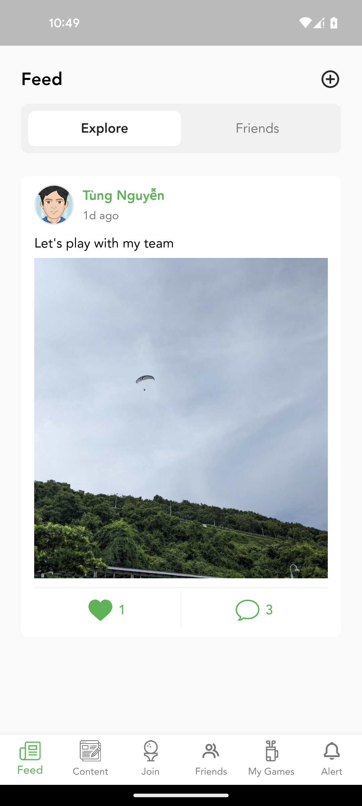
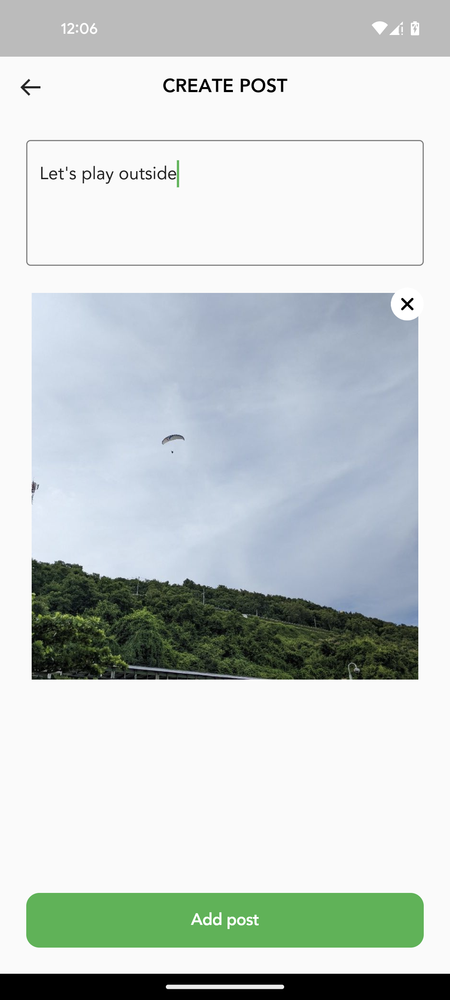
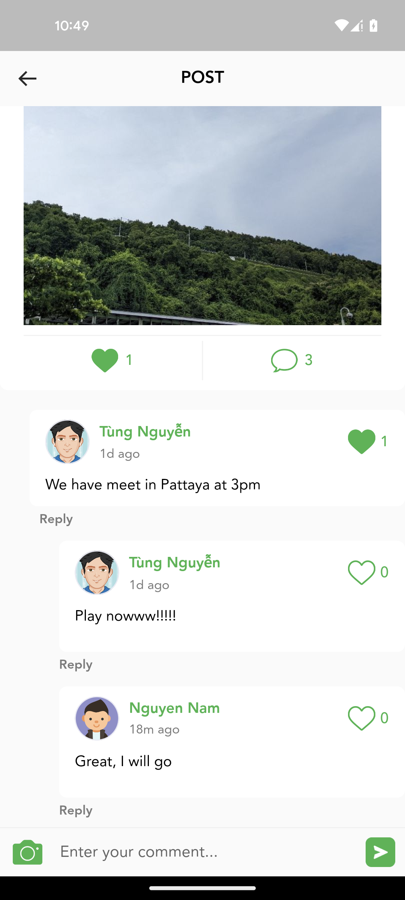

##### New game

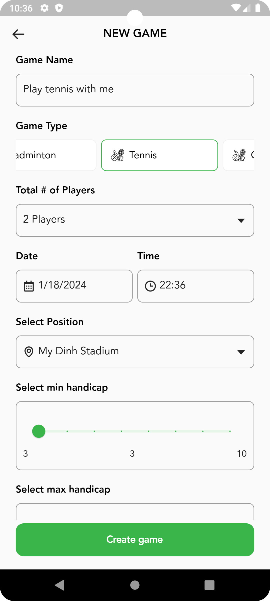
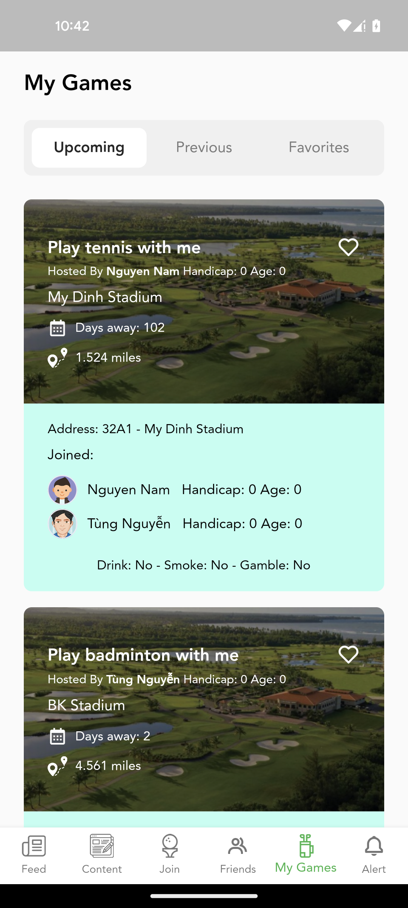

##### Join game

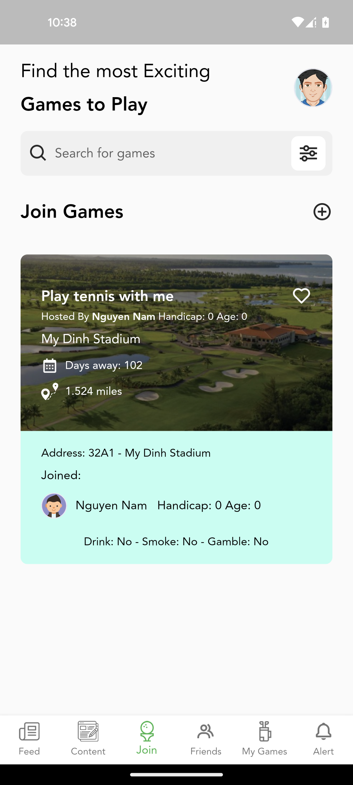
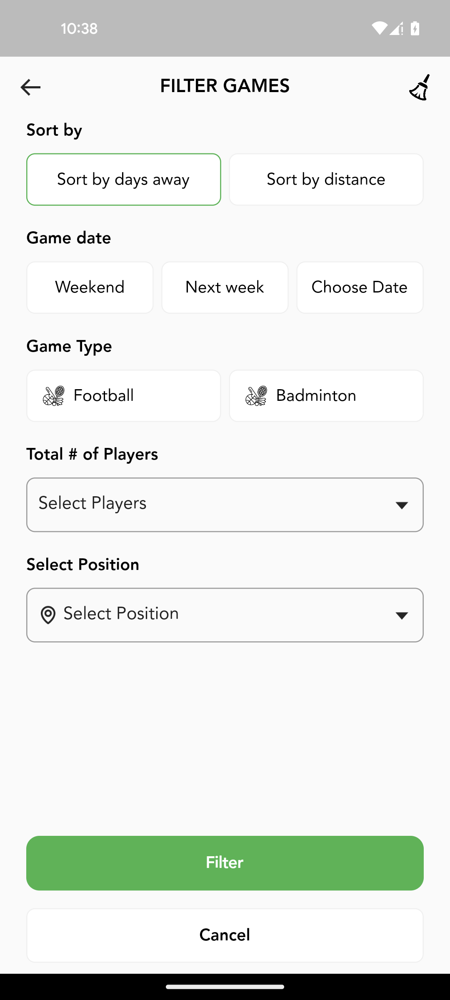
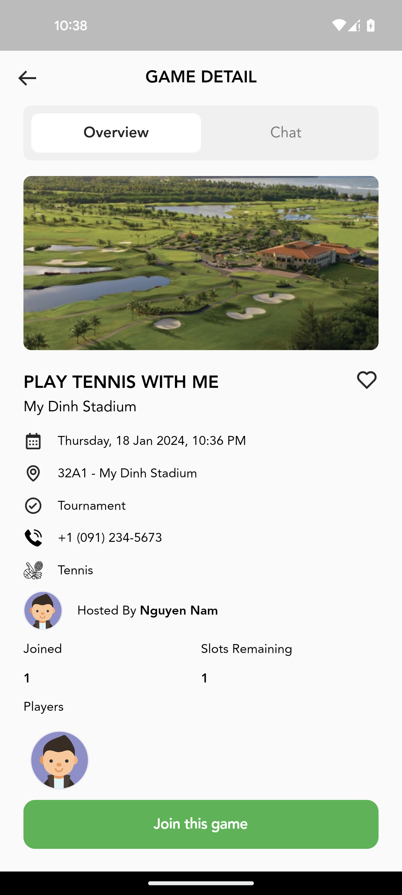
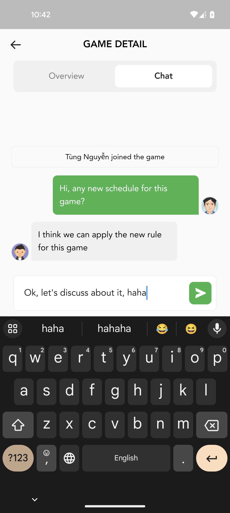

##### Friends

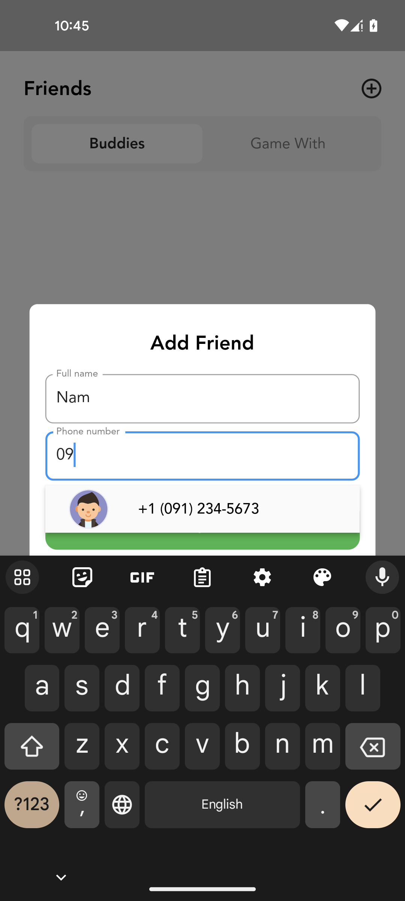
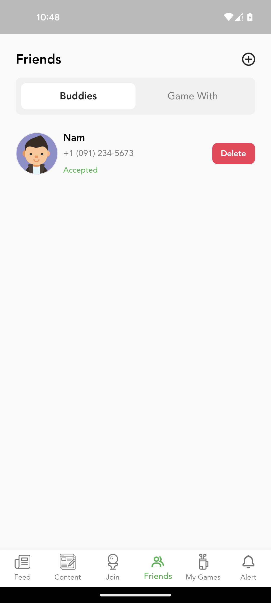

##### Personal

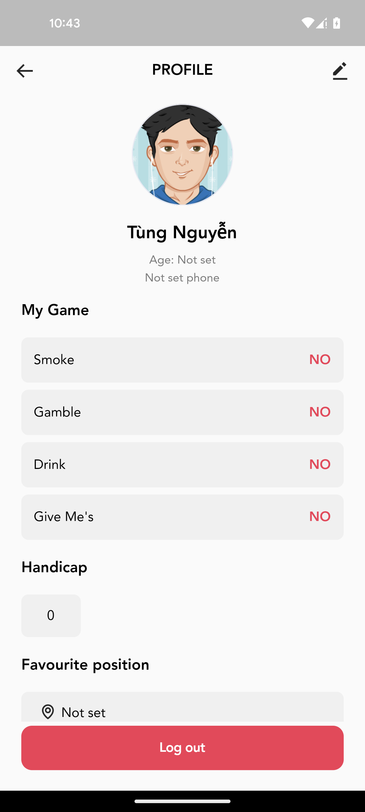
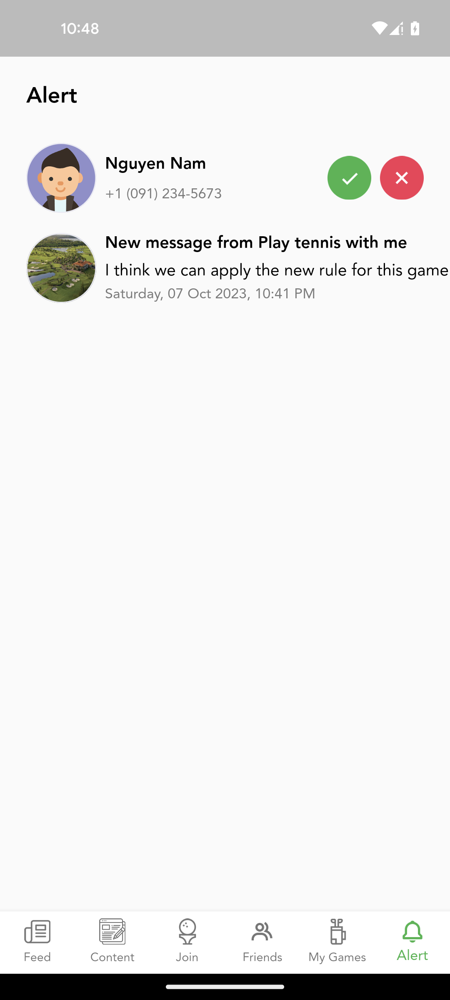

### License
[MIT](https://choosealicense.com/licenses/mit/)